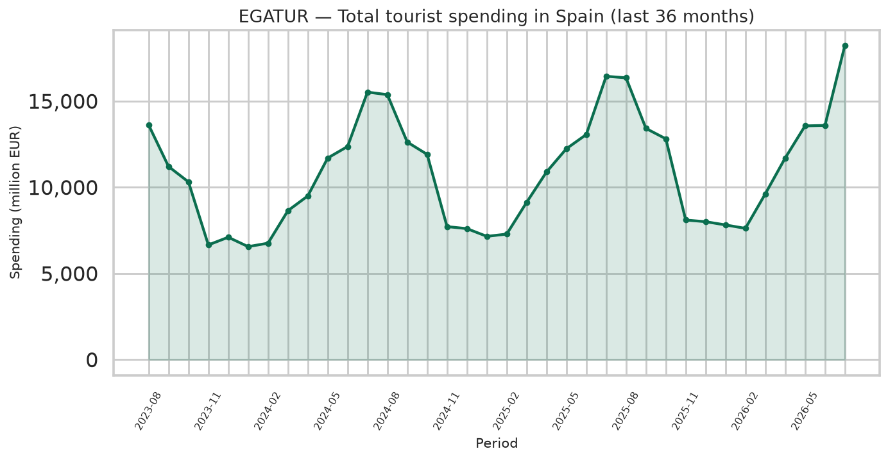
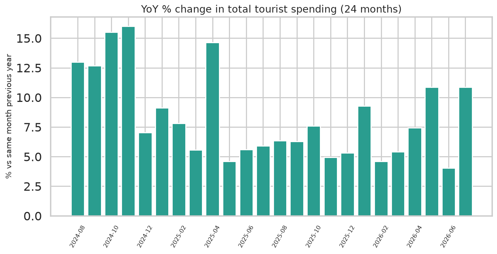
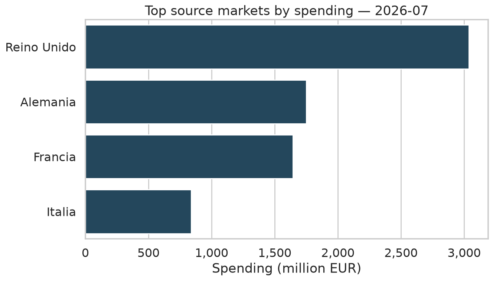
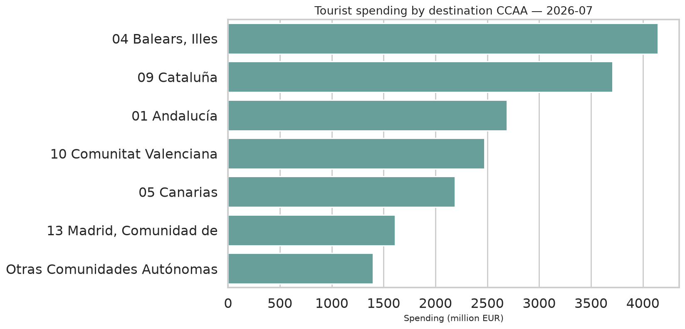
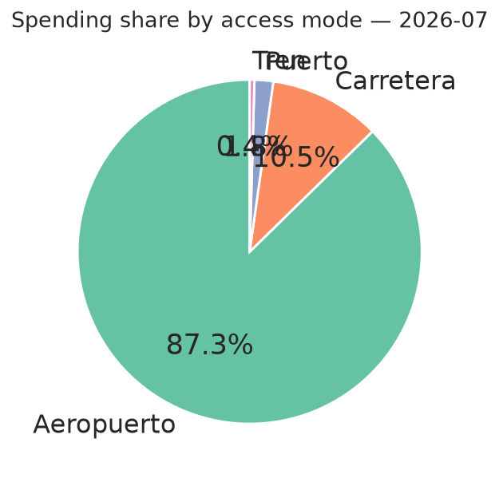
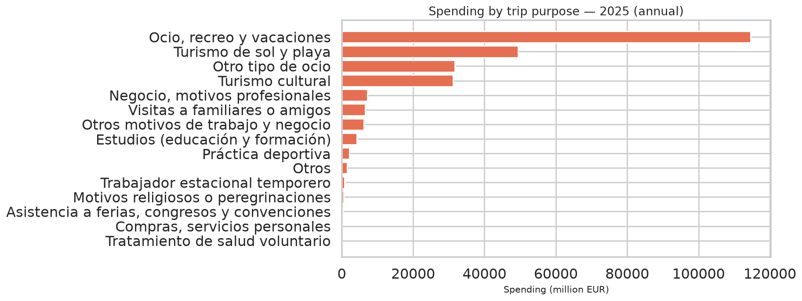

# EGATUR / INE — Tourist Spending ETL & Analytics (Spain)

**Public INE tourism-spend survey (EGATUR) → Python ETL → exploratory charts → Power BI**

[](https://www.python.org/)
[](https://pandas.pydata.org/)
[](https://powerbi.microsoft.com/)
[](LICENSE)

---

## Overview

End-to-end analytics project on Spain’s **EGATUR** (Encuesta de Gasto Turístico) from the **INE**:

1. **Extract** public INE CSV tables (spend by country, CCAA, access mode, trip purpose, spend items)
2. **Transform** with Pandas (European number formats, periods, long/tidy model)
3. **Analyze** with reproducible charts and written insights
4. **Present** in Power BI (`Proyecto Egatur INE.pbix`) plus regional evaluation notes

> Honest scope: this repo is a **portfolio analytics + ETL** project. Airflow / Docker / PostgreSQL orchestration is a natural next step, not claimed as already production-deployed here.

---

## Key findings (latest series month)

See [`outputs/insights.md`](outputs/insights.md) for the auto-generated snapshot. Highlights from the latest run:

- Clear **seasonality** in total tourist spending
- Concentration in a few **source markets** (UK, Germany, …)
- Destination value skewed to **Illes Balears, Cataluña, Andalucía**
- **Air** dominates access-mode spend share

### Charts

| | |
|:--|:--|
|  |  |
|  |  |
|  |  |

Power BI dashboard preview:


---

## Repository structure

```
data/raw/                 # INE public CSVs (10828, 10838, 10839, 13938, 23995)
data/processed/           # tidy long table (egatur_master_long.csv)
src/egatur_analysis.py    # ETL + chart generation
outputs/figures/          # PNG charts for portfolio / README
outputs/insights.md       # auto-written headline insights
Egatur_Power_BI_project.ipynb
Proyecto Egatur INE.pbix
Evaluacion_rendimiento_regional_INE.docx
```

---

## Quickstart

```bash
git clone https://github.com/Nicolenki7/ETL_Egatur_INE_Esp.git
cd ETL_Egatur_INE_Esp

python -m venv .venv
source .venv/bin/activate  # Windows: .venv\Scripts\activate
pip install -r requirements.txt

# Refresh analysis (expects CSVs under data/raw/)
python src/egatur_analysis.py
```

### Refresh raw INE extracts

```bash
mkdir -p data/raw && cd data/raw
for id in 13938 10838 10839 10828 23995; do
  curl -fsSL -o "${id}.csv" "https://www.ine.es/jaxiT3/files/t/es/csv_bdsc/${id}.csv"
done
```

---

## Data sources

| Table | Content |
| :--- | :--- |
| 13938 | Spend by expenditure item |
| 10838 | Spend by country of residence |
| 10839 | Spend by destination CCAA |
| 10828 | Spend by access mode |
| 23995 | Spend by trip purpose |

INE EGATUR portal: [INE — Tourism surveys](https://www.ine.es/dyngs/INEbase/es/categoria.htm?c=Estadistica_P&cid=1254734710106)

---

## Stack

| Layer | Tools |
| :--- | :--- |
| Ingestion / transform | Python, Pandas |
| EDA / storytelling | Matplotlib, Seaborn |
| BI | Power BI |
| Docs | Markdown insights + regional DOCX |

---

## Author

**Nicolas Zalazar** — Data Analyst · Aspiring Data Engineer · Mallorca, Spain  
GitHub: [@Nicolenki7](https://github.com/Nicolenki7) · LinkedIn: [nicolas-zalazar-63340923a](https://www.linkedin.com/in/nicolas-zalazar-63340923a)

---

## License

MIT (analysis code). INE statistical data remain under INE reuse terms.
